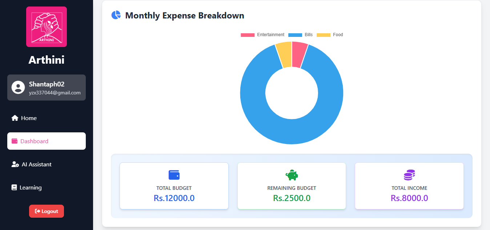
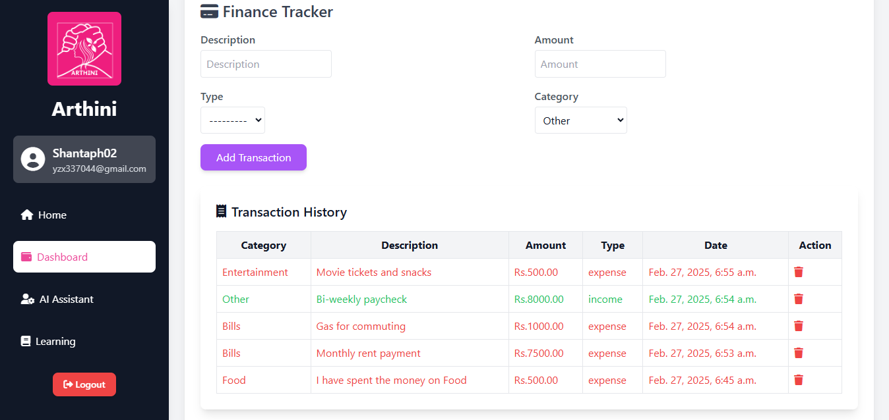
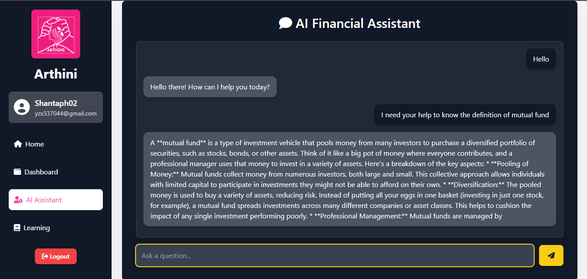

# Arthini

**Arthini** is a web application designed to help users manage their finances effectively. It features an interactive dashboard for financial tracking and an AI-powered assistant for financial guidance.
<table>
  <tr>
    <td></td>
    <td></td>
  </tr>
  <tr>
    <td></td>
    <td></td>
  </tr>
</table>


🚀 **Built for iAccelerate Women's Hackathon by Infosys Springboard**.

---

## 🌟 Features  

- **📊 Interactive Finance Dashboard** – Track expenses, savings, and financial goals efficiently.  
- **💸 Calculators** – Includes **SIP & EMI calculators** to estimate investments and loan repayments.  
- **🤖 AI Financial Assistant** – Integrated with **Gemini API** for real-time financial guidance.  
- **📈 Data Insights** – Provides personalized financial recommendations based on user data.  
- **🔐 Data Security** – Uses **secure authentication (Django authentication system)** and **MySQL database** for robust data protection. User credentials and financial data are securely stored and encrypted.  
- **🎨 User-Friendly UI** – Intuitive and responsive interface for seamless financial tracking.  

---

## 🛠️ Tech Stack  

- **Frontend:** HTML, Tailwind CSS, JavaScript  
- **Backend:** Django (Python)  
- **Database:** MySQL (for secure and scalable data storage)  
- **AI Model:** Gemini API (gemini-2.0-flash) for financial assistance  

---

## 🚀 Getting Started  

### 1️⃣ Clone the Repository  
```sh
git clone https://github.com/yourusername/ai-financial-assistant.git
cd ai-financial-assistant
```

### 2️⃣ Set Up the Virtual Environment and Install Dependencies  
```sh
python -m venv venv  # Create a virtual environment
source venv/bin/activate  # Activate (Linux/macOS)
venv\Scripts\activate  # Activate (Windows)

pip install -r requirements.txt  # Install dependencies
```

### 3️⃣ Configure Environment Variables  
Create a **.env** file in the root directory and add the following:

```ini
GEMINI_API_KEY=YOUR_API_KEY
DJANGO_SECRET_KEY='YOUR_SECRET_KEY'
EMAIL_HOST_USER='YOUR_EMAIL_ADDRESS'
EMAIL_HOST_PASSWORD='YOUR_APP_PASSWORD'

DB_NAME='YOUR_DATABASE_NAME'
DB_USER_NAME='YOUR_USER_NAME'
DB_PASSWORD='YOUR_DATABASE_PASSWORD'
DB_PORT='YOUR_DATABASE_PORT'
DB_HOST='YOUR_DATABASE_HOST'
DEBUG=False
```

### 4️⃣ Set Up the Database (MySQL)  
Ensure you have MySQL installed and running. Then, apply database migrations:
```sh
python manage.py migrate
```

### 5️⃣ Create a Superuser  
```sh
python manage.py createsuperuser
```
Follow the prompts to create an admin account.

### 6️⃣ Run the Development Server  
```sh
python manage.py runserver
```
The application will be available at `http://127.0.0.1:8000/`.

---

## 📜 License  
This project is licensed under the MIT License.
